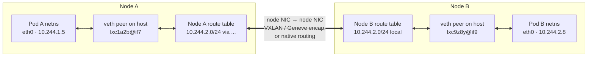
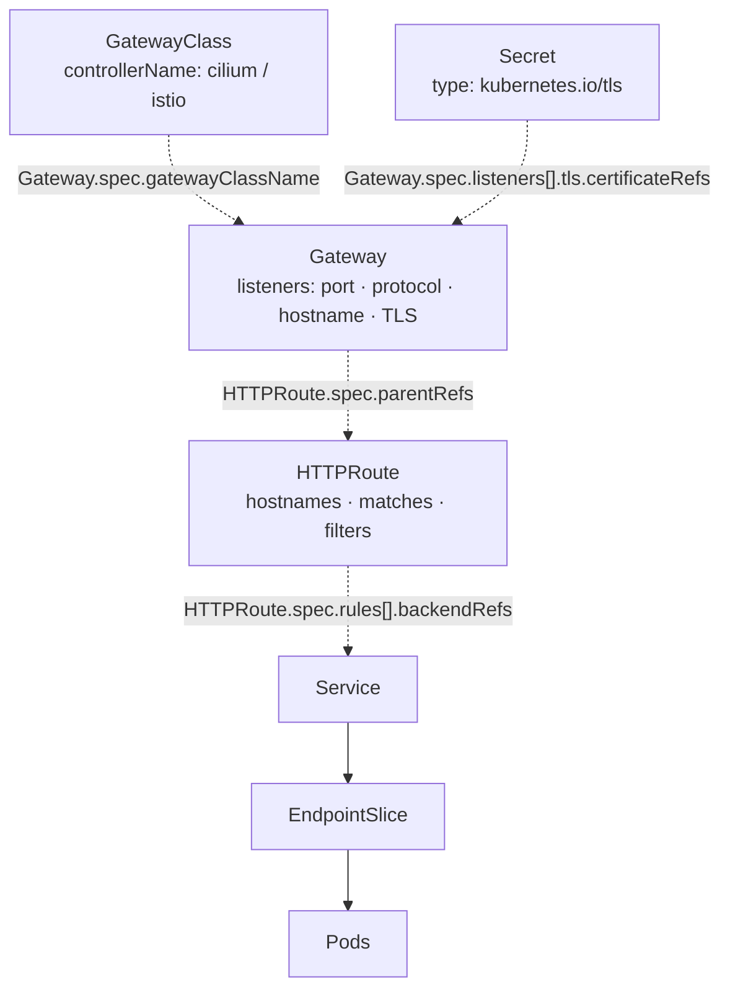
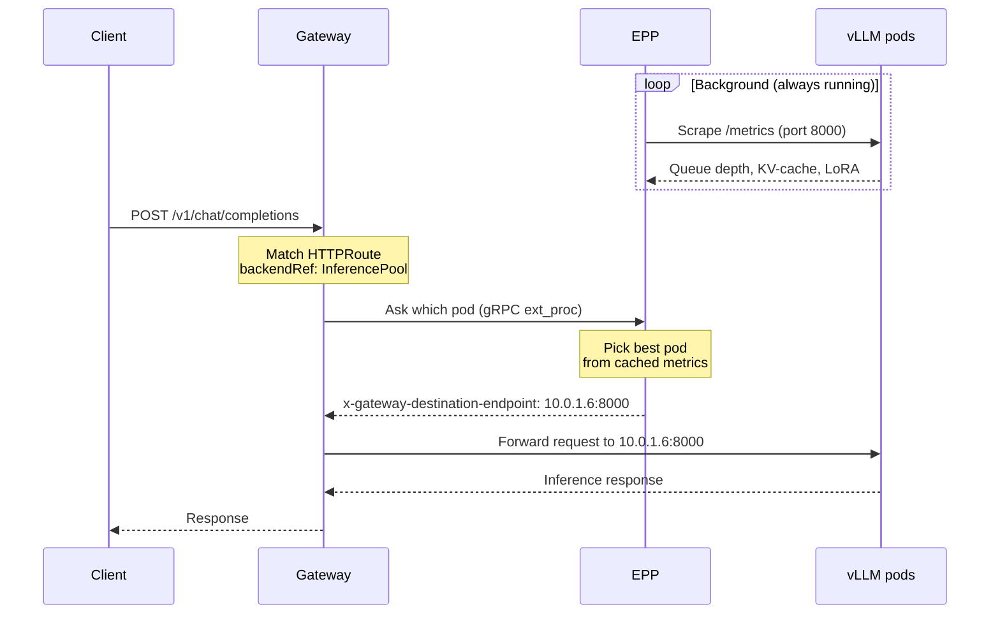

# CKNE Study Notes

Personal prep notes for the **Certified Kubernetes Networking Engineer (CKNE)** exam.

Each topic below maps to a domain in the official curriculum. Notes and resources get filled in as I go.

## Progress

| Domain | Weight | Written | Topics |
|---|---:|---:|---|
| [Core Infrastructure and CNI](#core-infrastructure-and-cni-15) | 15% | 5/5 | ✅✅✅✅✅ |
| [Service Networking and DNS](#service-networking-and-dns-25) | 25% | 5/6 | ✅✅✅✅🟡✅ |
| [Advanced Traffic Management](#advanced-traffic-management-20) | 20% | 2/4 | ✅🟡✅🟡 |
| [Network Security and Policy](#network-security-and-policy-25) | 25% | 4/4 | ✅✅✅✅ |
| [Observability](#observability-15) | 15% | 3/3 | ✅✅✅ |
| **Total** | **100%** | **19/22** | |

One marker per topic, in the order they appear in that domain:
✅ written up &nbsp;·&nbsp; 🟡 started, needs depth &nbsp;·&nbsp; ⬜ not started

Sections marked with a **Scope guess** blockquote were written from the topic name alone and are not yet
verified against the official curriculum — treat those as leads, not facts.

## Resources used in exam

https://docs.linuxfoundation.org/tc-docs/certification/important-instructions-ckne

Istio - Cilium - Envoy - Gateway API - Hubble - Prometheus - Helm - Jaeger - cert-manager

---

## Core Infrastructure and CNI (15%)

### Installing and Configuring CNI Plugins

_Notes:_

- Install Cilium Binary -> `cilium install`
- Before CNI, the Node would be 'Not Ready' status

#### Custom CNI
- you could setup a custom CNI by writing directly to `/etc/cni/net.d`, then node would be Ready
- Installing CNI would overwrite `/etc/cni/net.d` by default, and suffix any other config with `-backup`

#### `cilium install`
- it'd setup cilium daemonset that run on every node
- you'll see `/etc/cni/net.d/05-cilium.conflist` and `/opt/cni/bin/cilium-cni`
- kubelet on each node use `cilium-cni` binary to interact with cilium-agent pod, which then talk to API Server

#### Configuring after install
- `cilium upgrade --reuse-values --set <key>=<value>` — `--reuse-values` matters, without it you reset every other setting to chart defaults
- or `helm upgrade` directly; **watch the namespace** (`-n kube-system`), a wrong `-n` silently creates a second release
- `cilium config view` to dump the running config before changing anything

#### Static (system) pods
- manifests in `/etc/kubernetes/manifests` on the control plane — kubelet starts them with no API server involvement
- that's why `kube-apiserver`, `etcd`, `kube-controller-manager` come up before any CNI exists
- editing a file there makes kubelet restart that pod on its own; there is no Deployment to roll

_Resources:_

- https://killercoda.com/kylelaw/course/ckne/cni-install-and-configure
- labs.isovalent.com --> Foundations: Getting Started with Kubernetes Networking & Cilium

### Managing IPAM and Pod CIDR Allocation

_Notes:_

2 Ways to setup IPAM:

1. Kubernetes Host scope (Kubernetes native managed)
2. Cluster scope (CNI-managed)

Cilium `ipam` modes (`cilium config view | grep ipam`):
- `cluster-pool` — Cilium hands each node a slice of a pool it owns (the default)
- `kubernetes` — Cilium defers to the node's `spec.podCIDR` set by kube-controller-manager
- `multi-pool` — several named pools, pods pick one by annotation
- also `crd`, and the cloud modes (`eni`, `azure`, `gke`)

Where the CIDRs come from:
- **pod CIDR** -> `kubectl get node <n> -o jsonpath='{.spec.podCIDR}'`, or `--cluster-cidr` on kube-controller-manager
- **service CIDR** -> `--service-cluster-ip-range` on kube-apiserver, or `kubectl get servicecidr`
- extending the service CIDR is under [Troubleshooting Service Network Traffic](#troubleshooting-service-network-traffic)

_Resources:_

- labs.isovalent.com --> Cilium IPAM Lab
- https://labs.isovalent.com/#/playing/cilium-ipam/journey/day2

### Using Linux Tools (iptables, ip, tcpdump) for Packet-level Issues

_Notes:_

Usage:
- `ip a` show all IP Address
- `ip route` — which interface a destination leaves by; on a node this is where you see the per-node pod CIDR routes
- `ip link | grep <ifN>` — find the host side of a pod's veth pair
- `tcpdump -i <NIC name>` to see packet going through the NIC
- `tcpdump -i <interface> -q host <IP> -c 4` — quiet, filtered to one peer, stops after 4 packets (good enough to prove a path works)
- `sudo iptables -t nat -L KUBE-SERVICES -n -v --line-numbers` to see iptables related to Kubernetes services
- `iptables -t nat -L` — whole NAT table when you don't know the chain name yet 

Ideas to know:
- How to use `ip` to get the veth pair from pod to the host network
- How to use `tcpdump` to track packet going through a network interface
- Kubernetes Services are Virtual IP, they're essentially rules under `iptables rules` that forward to other pod endpoints

Pod-to-pod packet path (what `ip` and `tcpdump` are actually showing you):



Where to look at each hop:
- inside the pod -> `k exec` + `ip a`, note the `@ifN` index on `eth0`
- host side of the veth -> `ip link | grep ifN` on that node finds the peer
- on the wire -> `tcpdump -i <veth>` for the pod's own traffic, `tcpdump -i <node NIC>` for the inter-node leg

_Resources:_

### Troubleshooting Pod Connectivity (DNS, pod-to-pod)

_Notes:_

- By default, all pod can talk to each other

#### `kubectl debug` — the main troubleshooting tool
- into a running pod (ephemeral container, shares the pod's netns):
  `k debug po/<pod> --image=nicolaka/netshoot -it`
- onto a node (host netns, so you can see veths, routes and iptables):
  `k debug no/<node> --image=nicolaka/netshoot -it --profile=sysadmin`
- `--profile=sysadmin` is what grants the capabilities for `tcpdump`/`iptables`; without it most of those commands fail

#### DNS troubleshooting checklist
1. `kube-dns` Service exists and has endpoints -> `k -n kube-system get svc,ep kube-dns`
2. CoreDNS pods are Running -> `k -n kube-system get po -l k8s-app=kube-dns`
3. the pod's `/etc/resolv.conf` points at the kube-dns ClusterIP
4. if a mesh is in play, check the authorization policy (Istio `AuthorizationPolicy` can block :53)

#### CoreDNS

- CoreDNS can create an A record for every pod in this form:
`<pod-ip-with-dashes>.<namespace>.pod.cluster.local`
- If CoreDNS broken
  - `ping 10-244-1-5.default.pod.cluster.local` fails
  - `ping 10.244.1.5` (pod IP) still works
- Kubelet writes `/etc/resolv.conf` into every pod, which resolves DNS to kubedns services. Meaning if this file is broken, pod wouldn't be able to refer any name (Pod IP still works)
- `kube-dns` service forwards to CoreDNS pods created by coredns deployment in kube-system ns.

_Resources:_

### Configuring Multi-interface Pods

_Notes:_

I searched online and ... Multus is the best practice for this. Multus is a *CNI meta-plugin*: it delegates to other CNIs and attaches the extra interfaces.

- with Cilium you must set **`cni.exclusive=false`** first, otherwise Cilium keeps overwriting `/etc/cni/net.d` and Multus never gets a look in:
  `cilium upgrade --reuse-values --set cni.exclusive=false`
- extra interfaces are requested with the `k8s.v1.cni.cncf.io/networks` pod annotation, pointing at a `NetworkAttachmentDefinition`

Full walkthrough (Cilium + Multus setup): [1-5-Multi-Interface-Pod.md](1-5-Multi-Interface-Pod.md)

_Resources:_

---

## Service Networking and DNS (25%)

### Configuring L4 Services

_Notes:_

- a Kubernetes Service is essentially an L4 construct.
- kube-proxy implements ClusterIP/NodePort/LoadBalancer as iptables or IPVS NAT rules that match on destination IP + port + protocol (TCP/UDP/SCTP) and DNAT to a backend pod IP.
- Headless Services (clusterIP: None) aren't even L4. They're just DNS records returning pod IPs, and the client does its own balancing.
- `type: LoadBalancer` hands off to a cloud LB, which is usually L4 (NLB, TCP-mode), but some providers can be annotated into L7 mode. The Service object itself is still L4.
- L7 routing in k8s lives in Ingress, Gateway API, or a service mesh.
- Summarize: Service = L3/L4 virtual IP + port mapping, plus a DNS name. Anything smarter is a layer above it.

The four types, imperatively:
```bash
k create service clusterip   my-svc --tcp=80:8080
k create service nodeport    my-svc --tcp=80:8080 --node-port=30080
k create service loadbalancer my-svc --tcp=80:8080
k create service externalname my-ns --external-name bar.com
```
- `ExternalName` is the odd one out — no ClusterIP, no endpoints, no proxying. CoreDNS just returns a CNAME to the external name.

_Resources:_

### Understanding kube-proxy and CNI Alternatives

_Notes:_

- In Cilium, it can enable `kube-proxy-replacement` to not use kube-proxy entirely.
- **Why replace it:** kube-proxy in `iptables` mode evaluates rules as a linear chain, so service lookup cost grows with the number of services — O(n). Cilium's eBPF datapath uses a hash map, so lookup is O(1).
- Nuance worth keeping straight: kube-proxy's `ipvs` mode is *also* effectively O(1) (hash-based), so "kube-proxy is O(n)" is really "kube-proxy in iptables mode is O(n)". eBPF's further win is skipping the netfilter hooks altogether.
- `cilium status | grep KubeProxyReplacement` to see which mode is live

_Resources:_

### Customizing CoreDNS for Services

_Notes:_

- CoreDNS relies on a ConfigMap - coredns
- The CM is essentially the CoreFile mentioned in the official doc.
- You can modify this CM and restart coreDNS deployment to update it
- `reload` plugin is in the Corefile, so CoreDNS picks up CM changes on its own after ~30s; `k -n kube-system rollout restart deploy coredns` forces it

#### Per-pod DNS: `dnsPolicy` and `dnsConfig`
- `dnsPolicy` values: `ClusterFirst` (default), `ClusterFirstWithHostNet`, `Default` (inherit the node's resolv.conf), `None`
- `dnsConfig` lets you set `nameservers`, `searches` and `options` (e.g. `ndots`) yourself — **required** when `dnsPolicy: None`
- a pod on `hostNetwork: true` needs `ClusterFirstWithHostNet`, otherwise it silently loses cluster DNS

#### DNS name forms to know
- service -> `<svc>.<ns>.svc.cluster.local`
- pod -> `<pod-ip-with-dashes>.<ns>.pod.cluster.local`
- headless service backing pod -> `<pod>.<svc>.<ns>.svc.cluster.local`
- SRV record for a **named** port -> `_<port-name>._<proto>.<svc>.<ns>.svc.cluster.local`
  (`dig SRV _http._tcp.my-svc.default.svc.cluster.local` returns port + target)

```
ubuntu@k8s-t1-cp1:~$ k -n kube-system describe cm coredns 
Name:         coredns
Namespace:    kube-system
Labels:       <none>
Annotations:  <none>

Data
====
Corefile:
----
.:53 {
    errors
    health {
       lameduck 5s
    }
    ready
    kubernetes cluster.local in-addr.arpa ip6.arpa {
       pods insecure
       fallthrough in-addr.arpa ip6.arpa
       ttl 30
    }
    prometheus :9153
    forward . /etc/resolv.conf {
       max_concurrent 1000
    }
    cache 30 {
       disable success cluster.local
       disable denial cluster.local
    }
    loop
    reload
    loadbalance
}


BinaryData
====
```


_Resources:_

- https://kubernetes.io/docs/tasks/administer-cluster/dns-custom-nameservers/
- https://oneuptime.com/blog/post/2026-02-09-coredns-kubernetes-plugin-discovery/view
- https://coredns.io/manual/toc/

### Troubleshooting Service Network Traffic

_Notes:_

- Few types of Services: NodePort, ClusterIP, Headless, LoadBalancer, etc...
- Behind NodePort, there's still a ClusterIP (basically there's still a virtual IP to the NodePort service)
- Behind every services, there're `endpoints` objects telling you which Pod IP to forward traffic to
- `Endpoints` is the legacy object; the one actually used now is **`EndpointSlice`** (`k get endpointslices -l kubernetes.io/service-name=<svc>`). Each slice entry carries `ready` / `serving` / `terminating` conditions — that's where you see *why* a pod isn't receiving traffic
- For kube-proxy enabled cluster, can observe the services and pod IPs in `iptables rules`
- Can extend service CIDR with `servicecidr` object
- `k get servicecidr` to see the available service CIDR

_Resources:_

### Configuring Pod Endpoint Availability

_Notes:_

> Scope guess — I wrote this from the topic name, it is **not** verified against the curriculum. Confirm before trusting it.

This reads like "control when a pod is in, or out of, a Service's endpoints":
- **readiness probe** — the switch that adds/removes a pod from EndpointSlices. Failing readiness pulls traffic without restarting the pod (that's liveness)
- **startup probe** — holds the other two off while a slow app boots
- `publishNotReadyAddresses: true` on the Service — publish endpoints even when not ready (what headless StatefulSet services use for peer discovery)
- **`terminationGracePeriodSeconds`** + `preStop` — the gap where a pod is `terminating` but still draining; `EndpointSlice` marks it `serving: true, ready: false`
- `spec.trafficDistribution: PreferClose` / topology-aware routing — prefer endpoints in the same zone
- **PodDisruptionBudget** — keeps voluntary evictions from emptying the endpoint set

_Resources:_

### Managing Traffic with the Gateway API (Gateway, HTTPRoutes)

_Notes:_

GC -> GTW (TLS, protocol) -> HttpRoute (routing, paths) => SVC => Deployment => Pod



Dotted edge = a reference you write in YAML; the label names the field **and the object that declares it**, so the arrow points the opposite way to the ref itself (the HTTPRoute names the Gateway, not vice versa). Solid edge = resolved at runtime.

_Resources:_

https://killercoda.com/cka-mock-practice/scenario/configure-kubernetes-gateway-api

---

## Advanced Traffic Management (20%)

### Optimizing LLM Traffic

_Notes:_

Gateway API **Inference Extension** (`inference.networking.x-k8s.io`) — adds `InferencePool` + `InferenceModel` CRDs and an **EPP** (Endpoint Picker) that chooses a backend from live vLLM metrics instead of round-robin.

GC -> GTW (TLS, protocol) -> HttpRoute (routing, paths) -> InferencePool -> SVC -> Deployment (EPP)

Swimlane Diagram:



_Resources:_

- https://killercoda.com/kylelaw/course/ckne/inference-pool-by-hand

### Implementing Routing to Expose Networks

_Notes:_

> Scope guess — written from the topic name, **not** verified against the curriculum.

Most likely "get cluster networks reachable from outside without a cloud LB":
- **Cilium BGP Control Plane** — `CiliumBGPClusterConfig` / `CiliumBGPPeerConfig`, advertise pod CIDRs and service VIPs to a physical router
- **LB IPAM** — `CiliumLoadBalancerIPPool` hands real IPs to `type: LoadBalancer` on bare metal (no cloud provider needed)
- `externalIPs` on a Service, and plain NodePort, as the low-tech options
- direct routing vs tunnelling (`routing-mode=native` vs VXLAN/Geneve) — native needs the underlay to know your pod CIDRs, which is the reason BGP shows up

_Resources:_

### Configuring Egress Gateways for Cluster Exit Traffic

_Notes:_

- Problem it solves: pod traffic leaving the cluster is SNAT'd to whichever **node** it happened to run on, so an external firewall can't allowlist it. An egress gateway pins that exit to a fixed node + fixed IP.
- Cilium: `CiliumEgressGatewayPolicy` — select pods with a label selector, name the destination CIDR, name the gateway node and its egress IP
- needs `egressGateway.enabled=true` and BPF masquerading
- verify from outside with something that echoes your source IP

_Resources:_

- labs.isovalent.com --> Cilium Egress Gateway

### Implementing Cross Cluster Service Discovery and Load Balancing

_Notes:_

> Scope guess — written from the topic name, **not** verified against the curriculum.

Three routes to the same goal:
- **Cilium ClusterMesh** — `cilium clustermesh enable` + `cilium clustermesh connect`; each cluster needs a unique `cluster-name` / `cluster-id` and non-overlapping pod CIDRs. Annotate a Service `service.cilium.io/global: "true"` and it load-balances across both clusters
- **MCS API** (the upstream standard) — `ServiceExport` in the owning cluster produces a `ServiceImport` in the others, resolvable at `<svc>.<ns>.svc.clusterset.local`
- **Istio multicluster** — shared trust root, east-west gateway, remote secrets so each control plane can read the other's endpoints

Gotcha that applies to all three: overlapping pod/service CIDRs will break it, so plan IPAM first.

_Resources:_

---

## Network Security and Policy (25%)

### Securing Traffic with Network Policies

_Notes:_

- For Egress, rmb to create a rule to allow all pods accessible to `kube-dns` service, at TCP and UDP port 53 (`k -n kube-system get svc`)
- For kube-proxy enabled cluster, NP modify iptables rules
- Some CNI doesn't support NP, like Flannel. NP just created as normal Kubernetes object without any functionalities
- Default-deny is created by selecting everything with an empty `podSelector: {}` and naming the `policyTypes` you want to close
- **Cilium L7 NP** (if there's time): `CiliumNetworkPolicy` can match HTTP method + path, e.g. allow `GET /public` and drop `POST /admin`. Plain `NetworkPolicy` stops at L3/L4 — it cannot express a path
- L7 rules make Cilium put an Envoy proxy in the path, so a *drop* shows up as an HTTP 403 rather than a dropped packet

_Resources:_

### Implementing Node and Pod Level Encryption

_Notes:_

- From cilium, `cilium upgrade --reuse-values --set encryption.enabled=true --set-encryption.type=wireguard`
- Then there'll be a NIC for wireguard:

```
17: cilium_wg0: <POINTOPOINT,NOARP,UP,LOWER_UP> mtu 1405 qdisc noqueue state UNKNOWN group default 
    link/none
```

- `tcpdump -i cilium_wg0`: then use pod to send traffic to confirm that pod traffic go through wireguard NIC
- the real proof is the *negative* test: `tcpdump -i <node NIC>` should show no cleartext for that traffic
- WireGuard vs IPsec: WireGuard is the simpler option (`encryption.type=wireguard`), keys handled by Cilium; both encrypt node-to-node, so this is the "node level" half of the topic
- note the MTU drop (1405 above) — encapsulation overhead, a cause of "large requests hang, small ones work"

_Resources:_

### Managing TLS Certificates for Gateway API

_Notes:_

**Manual route**

1) TLS Secret
2) Setup during Gateway. (use `k explain gateway...` to figure out the tls fields during exam, or refer to Gateway API documentation

**cert-manager route (issued + renewed automatically)**

1. install cert-manager with Gateway API support turned on — it needs to be told to watch Gateway resources
   (verify the exact flag for your chart version: recent charts use `config.enableGatewayAPI=true`, older ones a
   `--feature-gates=ExperimentalGatewayAPISupport=true` arg. `helm show values jetstack/cert-manager | grep -i gateway`)
2. create an `Issuer` / `ClusterIssuer` — self-signed CA is the quickest for a lab:
   self-signed `Issuer` -> issues a CA `Certificate` -> a second `Issuer` of kind `ca` referencing that Secret
3. annotate the **Gateway** with `cert-manager.io/issuer` (or `cert-manager.io/cluster-issuer`) and give the listener's
   `tls.certificateRefs` a Secret name — cert-manager fills that Secret in for you
- `k describe certificate <n>` and `k get certificaterequest` are where you find out why a cert is stuck

_Resources:_

- https://cert-manager.io/docs/usage/gateway/

### Implementing Pod-level Authentication and Authorization

_Notes:_

- Pod Level is setup with Istio

| Need | Resource | What it does |
|---|---|---|
| Authentication (workload) | **PeerAuthentication** (PA) | mTLS between sidecars — `STRICT`, `PERMISSIVE`, `DISABLE`. Answers "which workload is this?" |
| Authentication (end user) | **RequestAuthentication** (RA) | validates JWTs (`jwtRules`, issuer + JWKS). Answers "which user is this?" |
| Authorization | **AuthorizationPolicy** (AP) | ALLOW/DENY on identity, namespace, method, path |

- `PERMISSIVE` accepts both plaintext and mTLS — that's the migration setting; `STRICT` is the one an exam task would want
- RA alone does **not** reject a request with no token; it only rejects an *invalid* one. You need an AP requiring `requestPrincipals` to actually force a token
- order: DENY policies are evaluated before ALLOW

_Resources:_

- PA (mTLS): https://killercoda.com/lorenzo-g/scenario/security-authentication-mtls
- AP (HTTP traffic): https://killercoda.com/lorenzo-g/scenario/security-authorization-http-traffic
- RA (JWT): https://killercoda.com/lorenzo-g/scenario/security-authorization-jwt-token

---

## Observability (15%)

### Analyzing Network Health Using Metrics

_Notes:_

- Prometheus, Hubble
- Install order: Prometheus **CRDs** (`ServiceMonitor`, `PodMonitor`) first, then the operator/stack — a `ServiceMonitor` applied before its CRD just errors
- Cilium/Hubble metrics are **off by default**. Turn them on and they expose a port Prometheus can scrape:
  `cilium upgrade --reuse-values --set prometheus.enabled=true --set operator.prometheus.enabled=true --set hubble.metrics.enabled="{dns,drop,tcp,flow,port-distribution}"`
- the networking layer of the scrape: each component exposes a metrics port -> a `ServiceMonitor` (label-selects the Service) tells Prometheus to scrape it -> check `/targets` in the Prometheus UI for UP/DOWN
- metrics that actually indicate network health: `hubble_drop_total` (by reason), `hubble_dns_queries_total` + failures, TCP retransmits, `cilium_unreachable_nodes`

_Resources:_

### Troubleshooting End to End Network Performance with Tracing

_Notes:_

Jaeger

- Tracing needs the **app** to propagate headers — a mesh can generate spans, but if the app drops `traceparent` / `x-b3-*` between inbound and outbound calls the trace breaks into disconnected pieces. This is the usual answer to "why is my trace only one span".
- Istio can sample and emit spans for you: set the tracing provider + `randomSamplingPercentage` (100 while testing, low in prod)
- Path: app/sidecar -> OpenTelemetry Collector -> Jaeger. The Jaeger **official demo** (HotROD) is the fastest way to see a full trace.
- Read a trace for *latency*: the widest span is the slow hop; a long gap between spans is usually queueing or DNS

_Resources:_

- Jaeger official demo (HotROD): https://www.jaegertracing.io/docs/latest/getting-started/
- https://killercoda.com/tekton/course/operations-observability/opentelemetry-jaeger
- https://killercoda.com/saiyampathak/course/cnpe/18-jaeger-tracing-otel
- https://killercoda.com/parker-smits/course/Zebra/jaeger
- https://killercoda.com/course-cnpe/scenario/playground-opentelemetry-jaeger
- https://killercoda.com/parker-smits/course/northrop/observability
- https://killercoda.com/cloud-origins/course/scenarios/32-opentelemetry-traces

### Auditing Traffic with Logs

_Notes:_

- Hubble
- Enable, then get a CLI on the host: `cilium upgrade --reuse-values --set hubble.relay.enabled=true --set hubble.ui.enabled=true`, then `cilium hubble port-forward &`
- `hubble observe` is the workhorse:
  - `hubble observe --verdict DROPPED` — start here, it answers "what is being blocked"
  - `hubble observe --pod <ns>/<pod> -f` — follow one pod
  - `hubble observe --protocol dns` — DNS lookups and their answers
  - `--to-fqdn`, `--port`, `--since 5m` to narrow further
- the drop **reason** is the useful field: `Policy denied` means a NetworkPolicy did it, which is how you tell policy problems from routing problems
- `hubble observe` needs L7 visibility annotations (or an L7 policy) before it can show HTTP paths — otherwise it stops at L3/L4

_Resources:_

- https://killercoda.com/kylelaw/course/ckne/flow-logs-and-drops
