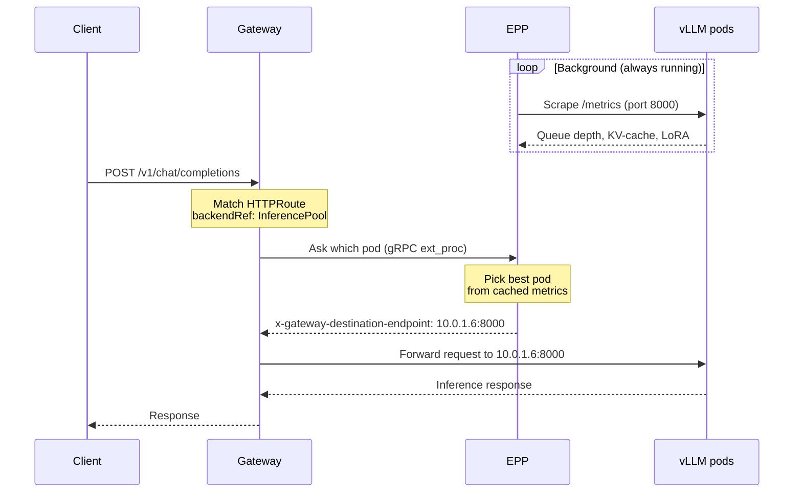

# CKNE Study Notes

Personal prep notes for the **Certified Kubernetes Networking Engineer (CKNE)** exam.

Each topic below maps to a domain in the official curriculum. Notes and resources get filled in as I go.

## Contents

- [Core Infrastructure and CNI (15%)](#core-infrastructure-and-cni-15)
- [Service Networking and DNS (25%)](#service-networking-and-dns-25)
- [Advanced Traffic Management (20%)](#advanced-traffic-management-20)
- [Network Security and Policy (25%)](#network-security-and-policy-25)
- [Observability (15%)](#observability-15)

---

## Core Infrastructure and CNI (15%)

### Installing and Configuring CNI Plugins

_Notes:_

Install Cilium Binary -> `cilium install`
Before CNI, the Node would be 'Not Ready' status

###### Custom CNI
- you could setup a custom CNI by writing directly to `/etc/cni/net.d`, then node would be Ready
- Installing CNI would overwrite `/etc/cni/net.d` by default, and suffix any other config with `-backup`

###### `cilium install`
- it'd setup cilium daemonset that run on every node
- you'll see `/etc/cni/net.d/05-cilium.conflist` and `/opt/cni/bin/cilium-cni`
- kubelet on each node use `cilium-cni` binary to interact with cilium-agent pod, which then talk to API Server

_Resources:_

- https://killercoda.com/kylelaw/course/ckne/cni-install-and-configure
- labs.isovalent.com --> Foundations: Getting Started with Kubernetes Networking & Cilium

### Managing IPAM and Pod CIDR Allocation

_Notes:_

2 Ways to setup IPAM - 

1. Kubernetes Host scope (Kubernetes native managed)
2. Cluster scope (CNI-managed)

_Resources:_

- labs.isovalent.com --> Cilium IPAM Lab

### Using Linux Tools (iptables, ip, tcpdump) for Packet-level Issues

_Notes:_

Usage:
- `ip a` show all IP Address
- `tcpdump -i <NIC name>` to see packet going through the NIC
- `sudo iptables -t nat -L KUBE-SERVICES -n -v --line-numbers` to see iptables related to Kubernetes services 

Ideas to know:
- How to use `ip` to get the veth pair from pod to the host network
- How to use `tcpdump` to track packet going through a network interface
- Kubernetes Services are Virtual IP, they're essentially rules under `iptables rules` that forward to other pod endpoints

_Resources:_

### Troubleshooting Pod Connectivity (DNS, pod-to-pod)

_Notes:_

- By default, all pod can talk to each other

##### CoreDNS

- CoreDNS can create an A record for every pod in this form:
`<pod-ip-with-dashes>.<namespace>.pod.cluster.local`
- If CoreDNS broken
-- `ping 10-244-1-5.default.pod.cluster.local` fails
-- `ping 10.244.1.5` (pod IP) still works
- Kubelet writes `/etc/resolv.conf` into every pod, which resolves DNS to kubedns services. Meaning if this file is broken, pod wouldn't be able to refer any name (Pod IP still works)
- `kube-dns` service forwards to CoreDNS pods created by coredns deployment in kube-system ns.

_Resources:_

### Configuring Multi-interface Pods

_Notes:_

I searched online and ... Multus is the best practice for this.

_Resources:_

---

## Service Networking and DNS (25%)

### Configuring L4 Services

_Notes:_

_Resources:_

### Understanding kube-proxy and CNI Alternatives

_Notes:_

- In Cilium, it can enable `kube-proxy-replacement` to not use kube-proxy entirely.

_Resources:_

### Customizing CoreDNS for Services

_Notes:_

_Resources:_

### Troubleshooting Service Network Traffic

_Notes:_

_Resources:_

### Configuring Pod Endpoint Availability

_Notes:_

_Resources:_

### Managing Traffic with the Gateway API (Gateway, HTTPRoutes)

_Notes:_

GC -> GTW (TLS, protocol) -> HttpRoute (routing, paths) => SVC => Deployment => Pod

_Resources:_

https://killercoda.com/cka-mock-practice/scenario/configure-kubernetes-gateway-api

---

## Advanced Traffic Management (20%)

### Optimizing LLM Traffic

_Notes:_

InferencePool CRD

GC -> GTW (TLS, protocol) -> HttpRoute (routing, paths) -> InferencePool -> SVC -> Deployment (EPP)

_Resources:_

### Implementing Routing to Expose Networks

_Notes:_

_Resources:_

### Configuring Egress Gateways for Cluster Exit Traffic

_Notes:_

_Resources:_

### Implementing Cross Cluster Service Discovery and Load Balancing

_Notes:_

_Resources:_

---

## Network Security and Policy (25%)

### Securing Traffic with Network Policies

_Notes:_

_Resources:_

### Implementing Node and Pod Level Encryption

_Notes:_

_Resources:_

### Managing TLS Certificates for Gateway API

_Notes:_

_Resources:_

### Implementing Pod-level Authentication and Authorization

_Notes:_

_Resources:_

---

## Observability (15%)

### Analyzing Network Health Using Metrics

_Notes:_

_Resources:_

### Troubleshooting End to End Network Performance with Tracing

_Notes:_

_Resources:_

### Auditing Traffic with Logs

_Notes:_

_Resources:_
