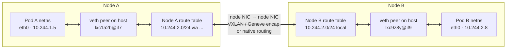
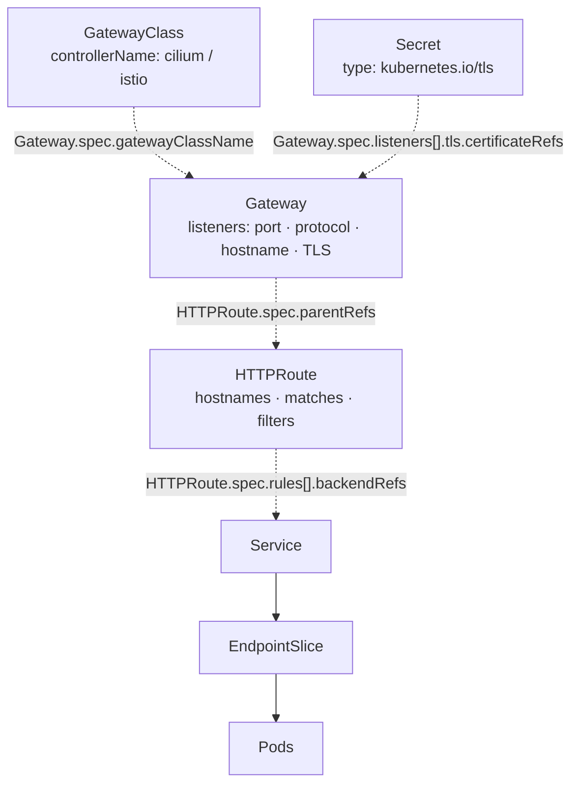
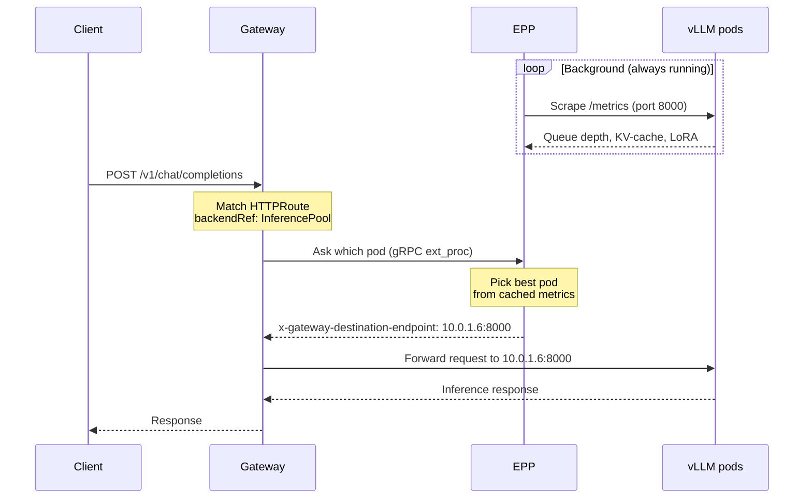

# CKNE Study Notes

Personal prep notes for the **Certified Kubernetes Networking Engineer (CKNE)** exam.

Each topic below maps to a domain in the official curriculum. Notes and resources get filled in as I go.

## Progress

| Domain | Weight | Written | Topics |
|---|---:|---:|---|
| [Core Infrastructure and CNI](#core-infrastructure-and-cni-15) | 15% | 4/5 | ✅✅✅✅🟡 |
| [Service Networking and DNS](#service-networking-and-dns-25) | 25% | 1/6 | ⬜🟡⬜✅⬜🟡 |
| [Advanced Traffic Management](#advanced-traffic-management-20) | 20% | 1/4 | ✅⬜⬜⬜ |
| [Network Security and Policy](#network-security-and-policy-25) | 25% | 2/4 | ✅⬜✅🟡 |
| [Observability](#observability-15) | 15% | 0/3 | 🟡🟡🟡 |
| **Total** | **100%** | **8/22** | |

One marker per topic, in the order they appear in that domain:
✅ written up &nbsp;·&nbsp; 🟡 started, needs depth &nbsp;·&nbsp; ⬜ not started

## Resources used in exam

https://docs.linuxfoundation.org/tc-docs/certification/important-instructions-ckne

Istio - Cilium - Envoy - Gateway API - Hubble - Prometheus - Helm - Jaeger - cert-manager

---

## Core Infrastructure and CNI (15%)

### Installing and Configuring CNI Plugins

_Notes:_

- Install Cilium Binary -> `cilium install`
- Before CNI, the Node would be 'Not Ready' status

#### Custom CNI
- you could setup a custom CNI by writing directly to `/etc/cni/net.d`, then node would be Ready
- Installing CNI would overwrite `/etc/cni/net.d` by default, and suffix any other config with `-backup`

#### `cilium install`
- it'd setup cilium daemonset that run on every node
- you'll see `/etc/cni/net.d/05-cilium.conflist` and `/opt/cni/bin/cilium-cni`
- kubelet on each node use `cilium-cni` binary to interact with cilium-agent pod, which then talk to API Server

_Resources:_

- https://killercoda.com/kylelaw/course/ckne/cni-install-and-configure
- labs.isovalent.com --> Foundations: Getting Started with Kubernetes Networking & Cilium

### Managing IPAM and Pod CIDR Allocation

_Notes:_

2 Ways to setup IPAM:

1. Kubernetes Host scope (Kubernetes native managed)
2. Cluster scope (CNI-managed)

_Resources:_

- labs.isovalent.com --> Cilium IPAM Lab

### Using Linux Tools (iptables, ip, tcpdump) for Packet-level Issues

_Notes:_

Usage:
- `ip a` show all IP Address
- `tcpdump -i <NIC name>` to see packet going through the NIC
- `sudo iptables -t nat -L KUBE-SERVICES -n -v --line-numbers` to see iptables related to Kubernetes services 

Ideas to know:
- How to use `ip` to get the veth pair from pod to the host network
- How to use `tcpdump` to track packet going through a network interface
- Kubernetes Services are Virtual IP, they're essentially rules under `iptables rules` that forward to other pod endpoints

Pod-to-pod packet path (what `ip` and `tcpdump` are actually showing you):



Where to look at each hop:
- inside the pod -> `k exec` + `ip a`, note the `@ifN` index on `eth0`
- host side of the veth -> `ip link | grep ifN` on that node finds the peer
- on the wire -> `tcpdump -i <veth>` for the pod's own traffic, `tcpdump -i <node NIC>` for the inter-node leg

_Resources:_

### Troubleshooting Pod Connectivity (DNS, pod-to-pod)

_Notes:_

- By default, all pod can talk to each other

#### CoreDNS

- CoreDNS can create an A record for every pod in this form:
`<pod-ip-with-dashes>.<namespace>.pod.cluster.local`
- If CoreDNS broken
  - `ping 10-244-1-5.default.pod.cluster.local` fails
  - `ping 10.244.1.5` (pod IP) still works
- Kubelet writes `/etc/resolv.conf` into every pod, which resolves DNS to kubedns services. Meaning if this file is broken, pod wouldn't be able to refer any name (Pod IP still works)
- `kube-dns` service forwards to CoreDNS pods created by coredns deployment in kube-system ns.

_Resources:_

### Configuring Multi-interface Pods

_Notes:_

I searched online and ... Multus is the best practice for this.

_Resources:_

---

## Service Networking and DNS (25%)

### Configuring L4 Services

_Notes:_

- a Kubernetes Service is essentially an L4 construct.
- kube-proxy implements ClusterIP/NodePort/LoadBalancer as iptables or IPVS NAT rules that match on destination IP + port + protocol (TCP/UDP/SCTP) and DNAT to a backend pod IP.
- Headless Services (clusterIP: None) aren't even L4. They're just DNS records returning pod IPs, and the client does its own balancing.
- `type: LoadBalancer` hands off to a cloud LB, which is usually L4 (NLB, TCP-mode), but some providers can be annotated into L7 mode. The Service object itself is still L4.
- L7 routing in k8s lives in Ingress, Gateway API, or a service mesh.
- Summarize: Service = L3/L4 virtual IP + port mapping, plus a DNS name. Anything smarter is a layer above it.

_Resources:_

### Understanding kube-proxy and CNI Alternatives

_Notes:_

- In Cilium, it can enable `kube-proxy-replacement` to not use kube-proxy entirely.


_Resources:_

### Customizing CoreDNS for Services

_Notes:_

_Resources:_

### Troubleshooting Service Network Traffic

_Notes:_

- Few types of Services: NodePort, ClusterIP, Headless, LoadBalancer, etc...
- Behind NodePort, there's still a ClusterIP (basically there's still a virtual IP to the NodePort service)
- Behind every services, there're `endpoints` objects telling you which Pod IP to forward traffic to
- For kube-proxy enabled cluster, can observe the services and pod IPs in `iptables rules`
- Can extend service CIDR with `servicecidr` object
- `k get servicecidr` to see the available service CIDR

_Resources:_

### Configuring Pod Endpoint Availability

_Notes:_

_Resources:_

### Managing Traffic with the Gateway API (Gateway, HTTPRoutes)

_Notes:_

GC -> GTW (TLS, protocol) -> HttpRoute (routing, paths) => SVC => Deployment => Pod



Dotted edge = a reference you write in YAML; the label names the field **and the object that declares it**, so the arrow points the opposite way to the ref itself (the HTTPRoute names the Gateway, not vice versa). Solid edge = resolved at runtime.

_Resources:_

https://killercoda.com/cka-mock-practice/scenario/configure-kubernetes-gateway-api

---

## Advanced Traffic Management (20%)

### Optimizing LLM Traffic

_Notes:_

InferencePool CRD

GC -> GTW (TLS, protocol) -> HttpRoute (routing, paths) -> InferencePool -> SVC -> Deployment (EPP)

Swimlane Diagram:



_Resources:_

- https://killercoda.com/kylelaw/course/ckne/inference-pool-by-hand

### Implementing Routing to Expose Networks

_Notes:_

_Resources:_

### Configuring Egress Gateways for Cluster Exit Traffic

_Notes:_

_Resources:_

### Implementing Cross Cluster Service Discovery and Load Balancing

_Notes:_

_Resources:_

---

## Network Security and Policy (25%)

### Securing Traffic with Network Policies

_Notes:_

- For Egress, rmb to create a rule to allow all pods accessible to `kube-dns` service, at TCP and UDP port 53 (`k -n kube-system get svc`)
- For kube-proxy enabled cluster, NP modify iptables rules
- Some CNI doesn't support NP, like Flannel. NP just created as normal Kubernetes object without any functionalities

_Resources:_

### Implementing Node and Pod Level Encryption

_Notes:_

- From cilium, `cilium upgrade --reuse-values --set encryption.enabled=true --set-encryption.type=wireguard`
- Then there'll be a NIC for wireguard:

```
17: cilium_wg0: <POINTOPOINT,NOARP,UP,LOWER_UP> mtu 1405 qdisc noqueue state UNKNOWN group default 
    link/none
```

- `tcpdump -i cilium_wg0`: then use pod to send traffic to confirm that pod traffic go through wireguard NIC

_Resources:_

### Managing TLS Certificates for Gateway API

_Notes:_

1) TLS Secret
2) Setup during Gateway. (use `k explain gateway...` to figure out the tls fields during exam, or refer to Gateway API documentation

_Resources:_

### Implementing Pod-level Authentication and Authorization

_Notes:_

- Pod Level is setup with Istio

_Resources:_

---

## Observability (15%)

### Analyzing Network Health Using Metrics

_Notes:_

- Prometheus, Hubble

_Resources:_

### Troubleshooting End to End Network Performance with Tracing

_Notes:_

Jaeger

_Resources:_

Hubble
- https://killercoda.com/kylelaw/course/ckne/flow-logs-and-drops
- 

Jaeger
- https://killercoda.com/tekton/course/operations-observability/opentelemetry-jaeger
- https://killercoda.com/saiyampathak/course/cnpe/18-jaeger-tracing-otel
- https://killercoda.com/parker-smits/course/Zebra/jaeger
- https://killercoda.com/course-cnpe/scenario/playground-opentelemetry-jaeger
- https://killercoda.com/parker-smits/course/northrop/observability
- https://killercoda.com/cloud-origins/course/scenarios/32-opentelemetry-traces
- 


### Auditing Traffic with Logs

_Notes:_

- Hubble

_Resources:_
